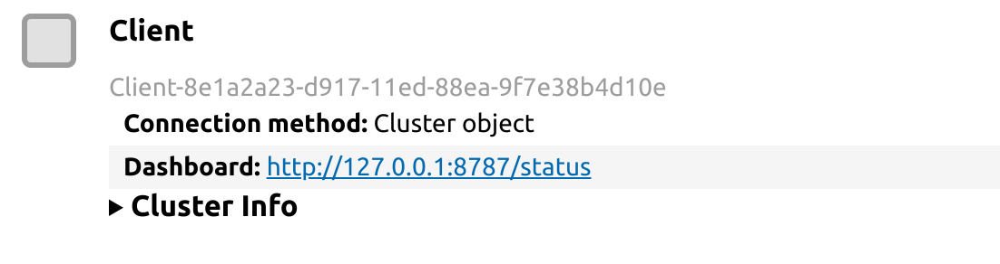

# Scaling up Lilio with Dask

Lilio supports [Dask](https://www.dask.org/) out of the box.
With Dask you can scale up your code so you can analyse large datasets more easily, or perform distributed computations.

To make use of this, you need to make sure that your input data consists of xarray `DataArray`s or `Dataset`s containing dask arrays.
Dask for pandas is currently not supported.

## Quick starter guide
For Dask novices, we outline some steps to get started on using Lilio with Dask.

### Required packages
Dask is not a required dependency of Lilio. If you do not have Dask yet, please install it using:
```bash
pip install dask[distributed]
```
Aditionally, for the Dask dashboard, Bokeh <3 and >=2.1.1 is required:
```
pip install "bokeh>=2.1.1,<3"
```

### Setting up the Dask client
[Nowadays it is recommended](https://docs.dask.org/en/stable/scheduling.html#dask-distributed-local) to use the distributed scheduler in Dask, even for local computations.
You start it by doing:
```python
from dask.distributed import Client
client = Client(n_workers=4, threads_per_worker=2)
```
The exact parameter values for `n_workers` and `threads_per_worker` will depend on your machine (e.g. CPU cores, available memory).

The `client` object can tell you where Dask's dashboard is located:



This dashboard can be very insightful for optimization of Dask computations.

### Loading in the data
An important step is properly loading in the input data. 
If Dask is installed, you can use the "parallel" and "chunks" keywords with xarray's `open_mfdataset`:

```python
from pathlib import Path
import xarray as xr

ds = xr.open_mfdataset(
    Path("/data/daily_era5").glob("*.nc"),
    parallel=True,
    chunks={'time': 30, "longitude": 320, "latitude": 361},
)
```

Here, setting an appropriate chunk size is important, as it can impact memory use and computational time. 
Rechunking later can be inefficient, and it is best defined when opening the data.
For more information, see [xarray's documentation on this topic](https://docs.xarray.dev/en/stable/user-guide/dask.html).

If you set the chunk size too large, this will lead to memory issues. If you set the chunks too small, there will be a lot of overhead from the Dask scheduler. You will also want to have a sufficient number of chunks to keep all workers and threads busy.
A good guide on choosing chunks sizes is available [on Dask's blog](https://blog.dask.org/2021/11/02/choosing-dask-chunk-sizes).

### Resampling with Dask
Now your `Dataset` consists of Dask arrays, and the client has been set up, all that's left is resampling your data as usual:
```python
data_resampled = lilio.resample(calendar, ds)
```

Note that this will (quite quickly) return a lazy Dataset: the computation has not been performed yet.
To compute the result do:
```python
data_resampled_results = data_resampled.compute()
```
While this is going on, have a look at the dashboard to see the workers being busy!

You can also select certain anchor years, or spatial regions, before you compute, if the full resampled data does not fit into memory.
